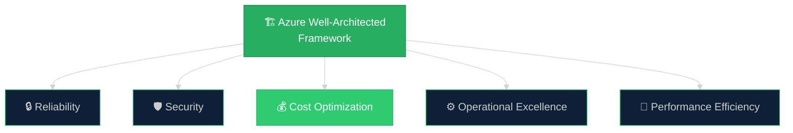
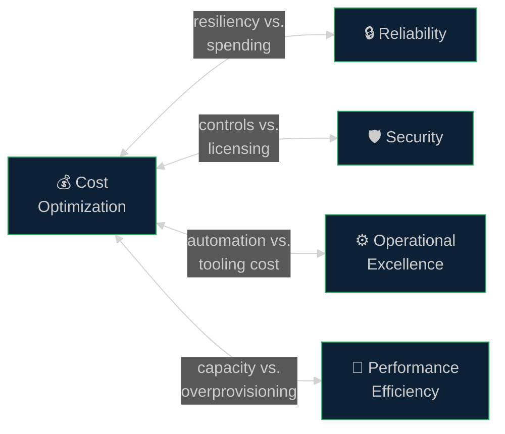
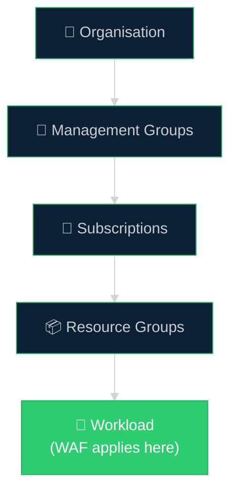
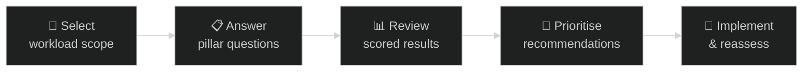

# 🏗️ 00 — Azure Well-Architected Framework Overview
{: .no_toc }

[🏠 Home](/waf-cost-opt/){: .btn .btn-outline .fs-3 }

  
📑 Table of Contents

  {: .text-delta }
- TOC
{:toc}

---

## What Is the Well-Architected Framework?

The **Azure Well-Architected Framework (WAF)** is a set of quality-driven tenets, architectural decision points, and review tools intended to help solution architects build a strong technical foundation for their workloads on Azure.

WAF is **not a checklist to pass** — it is a continuous improvement model. It provides guidance across five pillars, each representing a dimension of workload quality. The goal is to help architects make informed tradeoffs that align technology decisions with business objectives.

> **Official documentation:** [Azure Well-Architected Framework](https://learn.microsoft.com/en-us/azure/well-architected/)

---

## The Five Pillars

| Pillar | Focus | Key Question |
|--------|-------|-------------|
| **Reliability** | Uptime, recovery, redundancy, resiliency at scale | Can the workload meet its uptime and recovery targets? |
| **Security** | Confidentiality, integrity, protection from attacks | Is the workload protected against threats and data breaches? |
| **Cost Optimization** | ROI, spending discipline, rate and usage optimisation | Are we maximising the value of our Azure investment? |
| **Operational Excellence** | Observability, automation, deployment practices, incident response | Can we detect and resolve issues in production quickly? |
| **Performance Efficiency** | Scaling, load testing, meeting demand without waste | Can the workload handle changes in demand efficiently? |

Each pillar has its own:
- **Design principles** — high-level goals that guide architectural decisions
- **Checklist** — actionable recommendations (e.g. CO:01–CO:14 for Cost Optimization)
- **Tradeoffs** — documented tensions between pillars
- **Design patterns** — reusable architectural approaches

---

## How the Pillars Interact

The pillars are interconnected and require **deliberate tradeoffs**. Optimising for one pillar may create tension with another.

**Key tradeoff examples for Cost Optimization:**

| Tradeoff | Description |
|----------|-------------|
| **Cost vs. Reliability** | Reducing redundancy saves money but increases the risk of downtime. Using budget SKUs may limit achievable SLOs. |
| **Cost vs. Security** | Removing encryption, simplifying auth, or cutting security tooling lowers spend but weakens defence in depth. |
| **Cost vs. Operational Excellence** | Cutting testing, documentation, or automation reduces immediate spend but increases bugs, onboarding time, and operational risk. |
| **Cost vs. Performance** | Under-provisioning or aggressive auto-scale down saves money but may cause latency spikes or capacity failures. |

> A cost-optimised workload is **not** a low-cost workload. It is one that maximises return on investment while meeting its functional and nonfunctional requirements.

---

## Workload-Centric Approach

WAF is applied at the **workload** level — not at the subscription, tenant, or organisation level. A workload is a collection of application resources, data, and infrastructure that together deliver a defined business outcome.

**Why workload-level?**
- Different workloads have different business requirements and risk profiles
- A mission-critical production API has different cost tradeoffs than a dev/test environment
- Cost decisions must be contextualised to the workload's SLAs, compliance needs, and business value

---

## The WAF Assessment

Microsoft provides a **free, self-service assessment tool** — the **Azure Well-Architected Review** — that helps teams evaluate their workloads against each pillar.

| Aspect | Detail |
|--------|--------|
| **URL** | [Azure Well-Architected Review](https://learn.microsoft.com/en-us/assessments/azure-architecture-review/) |
| **Scope** | Per-workload (not per-subscription) |
| **Output** | Scored recommendations per pillar, prioritised action items |
| **Cost** | Free |
| **CSA role** | Facilitate the assessment with the customer, interpret results, and drive follow-up actions |

**Assessment flow:**

### CSA Tips for WAF Reviews

- **Start with business context** — understand the workload's purpose, SLAs, and business criticality before diving into the pillars
- **Don't try to cover all pillars in one session** — focus on the pillars most relevant to the customer's current pain points
- **Cost Optimization is often the entry point** — many customers come to WAF conversations driven by spending concerns
- **Use the assessment as a conversation starter**, not a compliance checklist
- **Document tradeoffs explicitly** — when a customer chooses a cheaper option, make sure the reliability or security implications are recorded

---

## WAF and Azure Service Guides

WAF includes **service-specific guidance** that maps WAF recommendations to individual Azure services. These are useful when a customer asks how to apply WAF principles to a specific resource type.

| Service Guide Example | Link |
|----------------------|------|
| Azure Virtual Machines | [VM service guide](https://learn.microsoft.com/en-us/azure/well-architected/service-guides/virtual-machines) |
| Azure SQL Database | [SQL DB service guide](https://learn.microsoft.com/en-us/azure/well-architected/service-guides/azure-sql-database) |
| Azure Kubernetes Service | [AKS service guide](https://learn.microsoft.com/en-us/azure/well-architected/service-guides/azure-kubernetes-service) |
| All service guides | [Browse service guides](https://learn.microsoft.com/en-us/azure/well-architected/service-guides/) |

---

## WAF Workload Perspectives

Beyond the five pillars, WAF also provides guidance for specific **workload types** that have unique architectural considerations:

| Workload Type | Focus |
|---------------|-------|
| **AI / ML** | Discriminative and generative AI models, inference costs, training optimisation |
| **SaaS** | Multi-tenancy, billing models, ISV cost structures |
| **Mission-Critical** | Always-available workloads where cost tradeoffs are bounded by strict SLOs |
| **SAP on Azure** | SAP-specific sizing, licensing, and migration cost considerations |
| **HPC** | Burst compute, Spot VM strategies, high-density scheduling |
| **Azure VMware Solution** | Hybrid migration staging, reserved node pricing |

---

## Where Cost Optimization Fits

Cost Optimization is one of five pillars, but it often serves as the **primary driver** for customer engagement with WAF. Customers rarely approach a CSA saying they want to improve operational excellence — they say they want to **reduce their Azure bill**.

This creates a natural entry point:

1. **Start with Cost Optimization** — address the customer's immediate concern
2. **Surface tradeoffs** — show how cost decisions impact reliability, security, and performance
3. **Broaden the conversation** — use the cost review to introduce the full WAF framework
4. **Establish continuous improvement** — position cost optimisation as an ongoing discipline, not a one-time exercise

> The next section dives deep into the **Cost Optimization pillar** — its design principles, checklist, tradeoffs, and maturity model.

---

[Next → 01 — Cost Optimization Deep Dive](/waf-cost-opt/01-cost-optimization-deep-dive/){: .btn .btn-primary .fs-5 }

[🏠 Home](/waf-cost-opt/){: .btn .btn-outline .fs-3 }
