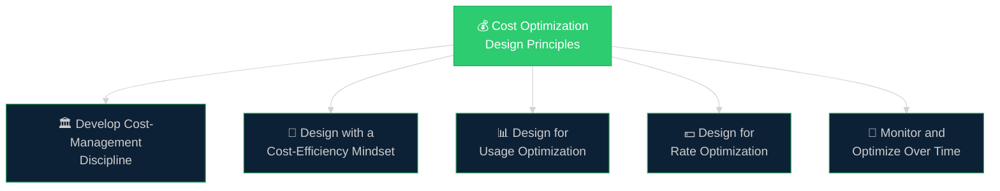
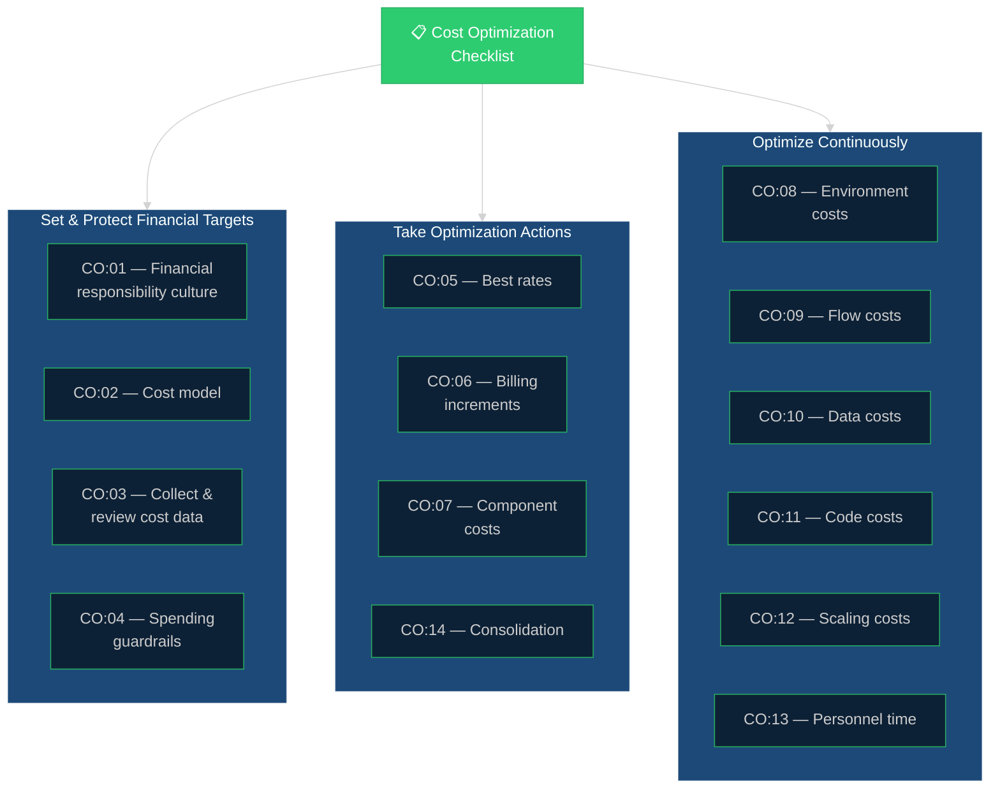

# 📐 01 — Cost Optimization Deep Dive
{: .no_toc }

[🏠 Home](/waf-cost-opt/){: .btn .btn-outline .fs-3 }

  
📑 Table of Contents

  {: .text-delta }
- TOC
{:toc}

---

## What Is Cost Optimization?

Cost Optimization is the pillar of the Azure Well-Architected Framework focused on **maximising the return on investment (ROI)** of your Azure spend. It is not about spending less — it is about spending effectively.

A cost-optimised workload balances actual costs against the business value it delivers, ensuring that every euro/dollar spent contributes to functional and nonfunctional requirements.

> **Official documentation:** [Cost Optimization pillar](https://learn.microsoft.com/en-us/azure/well-architected/cost-optimization/)

---

## The Five Design Principles

The Cost Optimization pillar is built on five design principles. These guide architectural decisions and serve as the foundation for the checklist recommendations.

### 1. Develop Cost-Management Discipline

Build a team culture with awareness of budget, expenses, reporting, and cost tracking.

| Approach | Benefit |
|----------|---------|
| Develop a cost model | Segment expenses and forecast total cost of ownership (TCO) |
| Establish clear accountability | Drive clarity on who owns what spend — enforce functional expectations per role |
| Estimate realistic budgets | Set financial boundaries covering functional requirements and anticipated growth |
| Plan for training and staffing costs | Complement existing skills and build capacity as the workload matures |
| Communicate cost implications of design changes | Enable practical budget adjustments based on production feedback |

### 2. Design with a Cost-Efficiency Mindset

Spend only on what you need to achieve the highest return on your investments.

| Approach | Benefit |
|----------|---------|
| Establish a cost baseline with projected growth | Forecast expenses, pinpoint key cost drivers, and reveal hidden costs |
| Design and enforce cost guardrails | Prevent incidental or unapproved charges — only budgeted resources get provisioned |
| Treat SDLC environments differently | Non-production environments don't need to simulate production fully — save on SKUs, instance counts, and features |

### 3. Design for Usage Optimization

Maximise the use of resources and operations — apply them to negotiated requirements.

| Approach | Benefit |
|----------|---------|
| Use full capabilities of selected SKUs | Avoid paying for features you don't use; avoid SKUs with unnecessary extras |
| Evaluate dynamic scaling opportunities | Scale up when demand increases, scale down when it drops — align cost to actual usage |
| Prefer active-active over active-passive where feasible | Use idle DR resources productively for load levelling or scale bursting |
| Use commitment-based resources for new features | Apply committed plans to reduce cost of implementing new functionality |
| Make the most of your support plan | Use support for production problems and proactive reviews — get your money's worth |

### 4. Design for Rate Optimization

Increase efficiency without redesigning, renegotiating, or sacrificing requirements.

| Approach | Benefit |
|----------|---------|
| Prepurchase resources with stable/predictable usage | Microsoft offers discounted rates for long-term commitments (Reservations, Savings Plans) |
| Explore alternatives that reduce licensing costs | Azure Hybrid Benefit, Dev/Test pricing, license portability |
| Use consumption-based pricing when more cost-effective | Pay-as-you-go may beat a partially utilised prepaid option |
| Use fixed-price billing when utilisation is high and predictable | Fixed-price is usually cheaper at high, consistent utilisation |
| Co-locate usage with other workloads | Shared resources reduce cost per unit and management overhead |
| Deploy to lower-cost regions where feasible | Use premium regions only where necessary — leverage cheaper regions for pre-production |
| Prefer services that support higher density | Higher density means fewer resources needed — reduces cost per unit |

### 5. Monitor and Optimize Over Time

Continuously right-size investment as your workload evolves.

| Approach | Benefit |
|----------|---------|
| Build expense capture and classification capabilities | Calculate costs from both technical and business perspectives at different billing boundaries |
| Implement cost alerts at budget thresholds | Proactive notifications prevent budget overruns |
| Continuously evaluate architecture decisions around cost | Regular reviews of metrics, billing reports, and feature usage lead to fine-tuning |
| Decommission underutilised, unused, or obsolete resources | Reduce waste and free up funds for higher-value investments |

---

## The Cost Optimization Checklist (CO:01–CO:14)

The checklist translates design principles into **actionable recommendations**. Each item maps to a detailed how-to guide in the official documentation.

| Code | Recommendation | Design Area |
|------|---------------|-------------|
| **CO:01** | Create a culture of financial responsibility — training, accountability, tooling, automation | Cost-management discipline |
| **CO:02** | Create and maintain a cost model — initial cost, run rates, ongoing costs, buffer for unplanned spending | Cost-management discipline |
| **CO:03** | Collect and review cost data — daily costs, amortised costs, trends, forecasts, stakeholder reviews | Cost-management discipline |
| **CO:04** | Set spending guardrails — release gates, governance policies, resource limits, access controls | Cost-management discipline |
| **CO:05** | Get the best rates from providers — regional pricing, tiers, models, license portability, corporate plans | Rate optimization |
| **CO:06** | Align usage to billing increments — understand meters, modify services or usage to match billing units | Usage optimization |
| **CO:07** | Optimise component costs — remove or optimise legacy, unneeded, and underutilised components | Component optimization |
| **CO:08** | Optimise environment costs — align spending to prioritise production, pre-production, DR environments | Environment optimization |
| **CO:09** | Optimise flow costs — align cost of each flow with flow priority, consider strategic compromises | Flow optimization |
| **CO:10** | Optimise data costs — tiering, retention, volume, replication, backups, file formats, storage solutions | Data optimization |
| **CO:11** | Optimise code costs — evaluate and modify code to meet requirements with fewer or cheaper resources | Code optimization |
| **CO:12** | Optimise scaling costs — evaluate alternative scaling configurations, control demand and supply | Scaling optimization |
| **CO:13** | Optimise personnel time — align time spent on tasks with task priority, reduce noise and build times | Personnel optimization |
| **CO:14** | Consolidate resources and responsibility — increase density within workload, leverage centralised services | Consolidation |

> **Full checklist with links:** [Design review checklist for Cost Optimization](https://learn.microsoft.com/en-us/azure/well-architected/cost-optimization/checklist)

---

## Checklist Design Areas Mapped

---

## Tradeoffs with Other Pillars

Cost Optimization decisions always create tension with at least one other pillar. Understanding and documenting these tradeoffs is essential for CSA conversations.

### Cost vs. Reliability

| Risk | Example |
|------|---------|
| Reduced resiliency | Under-provisioning, consolidating resources into fewer instances, removing message buses |
| Limited recovery | Fewer backups, reduced DR testing, cheaper support contracts with slower response |
| Increased complexity | Adding CDN or edge caching for cost savings introduces new components that need reliability targets |

### Cost vs. Security

| Risk | Example |
|------|---------|
| Reduced controls | Simplifying auth (pre-shared keys vs. OAuth), removing encryption, cutting security scanning |
| Increased surface area | Adding CDN, valet key pattern, or queue-based load levelling introduces components to secure |
| Removed segmentation | Multi-tenancy and co-location increase blast radius and complicate access controls |

### Cost vs. Operational Excellence

| Risk | Example |
|------|---------|
| Compromised SDLC | Reducing test coverage, deferring tech debt, cutting documentation or training |
| Reduced observability | Cutting log volume, reducing monitoring investment, fewer dashboards |
| Deferred maintenance | Letting vendor contracts lapse, increasing patching intervals |

### Cost vs. Performance Efficiency

| Risk | Example |
|------|---------|
| Under-provisioned resources | Downsizing VMs, aggressive auto-scale down, hard spending caps blocking scaling |
| Lack of optimisation over time | Skipping performance testing, neglecting database query optimisation |

---

## The Maturity Model

The Cost Optimization pillar includes a **maturity model** that helps organisations assess their current level of cost discipline and plan for improvement.

| Level | Description |
|-------|-------------|
| **Level 0 — Ad hoc** | No formal cost management. Spending is reactive. No budgets, no visibility, no accountability. |
| **Level 1 — Foundational** | Basic cost tracking in place. Budgets exist but are not enforced. Some awareness of spending patterns. |
| **Level 2 — Standardised** | Cost management processes are documented and repeatable. Tagging, budgets, and alerts are in place. Regular reviews occur. |
| **Level 3 — Optimised** | Proactive cost optimisation is embedded in the SDLC. Commitment-based plans are used. Cost is a design consideration. |
| **Level 4 — Innovative** | Cost efficiency drives architectural innovation. FinOps practices are mature. Cost data feeds automated decision-making. |

> **Full maturity model:** [Cost Optimization maturity model](https://learn.microsoft.com/en-us/azure/well-architected/cost-optimization/maturity-model)

### CSA Tips: Using the Maturity Model

- **Assess where the customer is today** — most organisations are at Level 1 or 2
- **Set realistic next-level targets** — jumping from Level 0 to Level 3 is not practical
- **Use the model to structure follow-up engagements** — each level becomes a milestone
- **Connect maturity levels to business outcomes** — Level 3+ organisations typically show measurable reduction in waste

---

## Cost Optimization Design Patterns

Microsoft documents several **cloud design patterns** that support cost optimisation:

| Pattern | Description |
|---------|-------------|
| **Queue-Based Load Levelling** | Use a queue to buffer requests and smooth demand peaks — avoid over-provisioning |
| **Static Content Hosting** | Offload static assets to blob storage + CDN — reduce compute costs |
| **Valet Key** | Issue temporary tokens for direct client-to-storage access — reduce server-side processing |
| **Autoscaling** | Dynamically adjust capacity based on demand — avoid paying for idle resources |
| **Deployment Stamps** | Deploy isolated instances per region or tenant — optimise per-stamp costs |
| **Throttling** | Limit consumption of expensive resources — protect against cost spikes |

> **Full pattern list:** [Cost Optimization design patterns](https://learn.microsoft.com/en-us/azure/well-architected/cost-optimization/design-patterns)

---

## Key Takeaways for CSA Conversations

1. **Cost Optimization is not about cutting costs** — it's about maximising ROI while meeting requirements
2. **Every cost decision has tradeoffs** — document them explicitly with the customer
3. **The checklist (CO:01–CO:14) provides structure** — use it to guide systematic reviews
4. **Maturity takes time** — help customers build sustainable practices, not one-time fixes
5. **Rate optimisation is the quickest win** — Reservations, Savings Plans, and AHB can deliver immediate savings without architectural changes

---

[← Previous: WAF Overview](/waf-cost-opt/00-waf-overview/){: .btn .btn-outline .fs-5 .mr-2 }
[Next → 02 — Savings Opportunities](/waf-cost-opt/02-savings-opportunities/){: .btn .btn-primary .fs-5 }

[🏠 Home](/waf-cost-opt/){: .btn .btn-outline .fs-3 }
