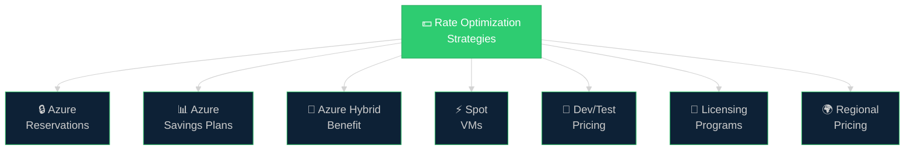
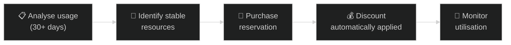
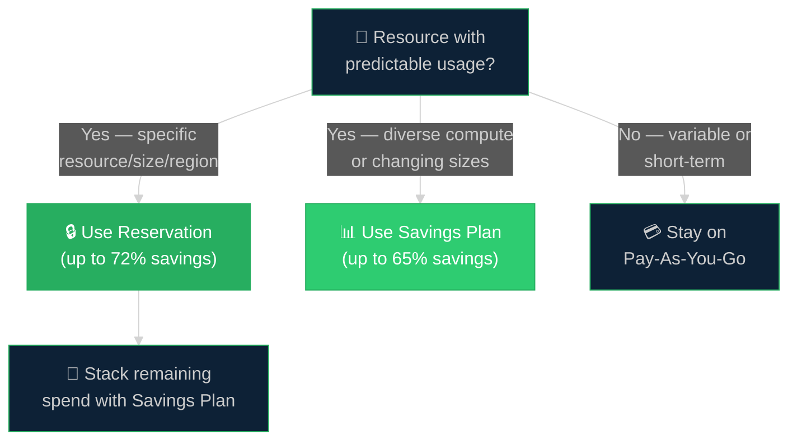
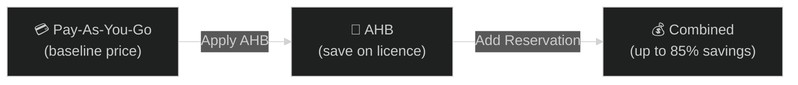
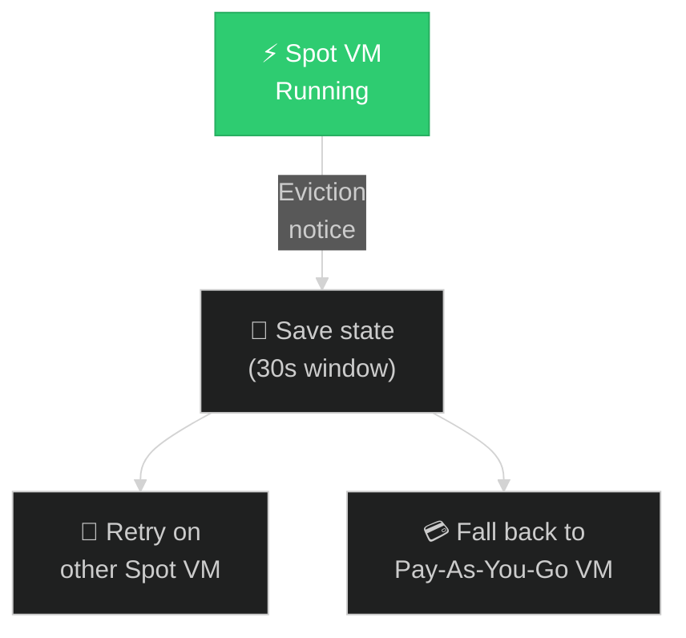

# 💵 02 — Savings Opportunities
{: .no_toc }

[🏠 Home](/waf-cost-opt/){: .btn .btn-outline .fs-3 }

  
📑 Table of Contents

  {: .text-delta }
- TOC
{:toc}

---

## Overview

Rate optimisation is about getting **better prices for the same resources** — without changing your architecture or functionality. This is often the fastest path to measurable savings and maps directly to checklist item **CO:05** (Get the best rates from providers).

The strategies on this page can be applied immediately and typically deliver savings of **20–72%** depending on the commitment type, term length, and resource.

> **Official documentation:** [Get the best rates from providers](https://learn.microsoft.com/en-us/azure/well-architected/cost-optimization/get-best-rates)

---

## Savings Mechanism Comparison

| Mechanism | Savings Range | Commitment | Flexibility | Best For |
|-----------|:------------:|:----------:|:-----------:|----------|
| **Reservations** | Up to **72%** | 1 or 3 years | Low — specific resource/region/size | Stable, predictable workloads |
| **Savings Plans** | Up to **65%** | 1 or 3 years | High — broad compute coverage | Diverse or evolving compute |
| **Azure Hybrid Benefit** | Up to **85%** (combined) | Existing licences | Medium | Customers with Windows/SQL/Linux licences |
| **Spot VMs** | Up to **90%** | None | Very high — can be evicted | Fault-tolerant, batch, stateless |
| **Dev/Test Pricing** | Varies | None | High | Non-production environments |
| **Regional Pricing** | 10–30% | None | Varies | Workloads without region constraints |

---

## Azure Reservations

Reservations let you **prepay for a fixed amount of capacity** for a 1-year or 3-year term in exchange for a significant discount over pay-as-you-go pricing.

### How Reservations Work

| Aspect | Detail |
|--------|--------|
| **Scope** | Single subscription, shared across subscriptions, or management group |
| **Terms** | 1 year or 3 years |
| **Payment** | Upfront, monthly, or mixed (depends on agreement type) |
| **Discount type** | Billing discount — does not affect runtime state |
| **Exchangeable** | Yes — you can exchange for a different reservation of equal or greater value |
| **Refundable** | Yes — early cancellation with pro-rated refund (subject to limits) |

### Resources That Support Reservations

| Category | Examples |
|----------|---------|
| **Compute** | Virtual Machines, Azure Dedicated Host, Azure VMware Solution |
| **Storage** | Azure Blob (reserved capacity), Azure Files, Azure Managed Disks |
| **Databases** | Azure SQL Database, Azure Cosmos DB, Azure Database for PostgreSQL/MySQL |
| **Networking** | Azure ExpressRoute, Azure App Service (Isolated tier) |
| **Analytics** | Azure Synapse Analytics, Azure Data Explorer |
| **Other** | Azure Red Hat OpenShift, Azure App Service (Premium v3) |

### When to Use Reservations

- **Stable, predictable workloads** — VMs that run 24/7, databases with consistent DTU/vCore usage
- **Production environments** — workloads you know will run for 1+ years
- **Start with the minimum consistent usage** — commit to the baseline, cover spikes with pay-as-you-go

> Start with reservations for your most stable, highest-spend resources. Microsoft recommends reviewing at least 30 days of usage data before committing.

---

## Azure Savings Plans

Savings Plans offer a **flexible, commitment-based discount** that applies across a broad range of compute services. You commit to a fixed hourly spend (in USD or local currency for EA) for 1 or 3 years.

### Reservations vs. Savings Plans

| Dimension | Reservations | Savings Plans |
|-----------|:------------:|:-------------:|
| **Commitment** | Specific resource (VM size, region, OS) | Hourly $ amount on compute |
| **Flexibility** | Low — tied to specific parameters | High — covers VMs, App Service, Functions, Container Instances |
| **Max discount** | Up to **72%** | Up to **65%** |
| **Scope** | Subscription, shared, or management group | Subscription, shared, or management group |
| **Best for** | Known, stable resources | Diverse or changing compute |
| **Stacking** | Can combine with Savings Plans | Can combine with Reservations |

### Decision Flow

> **Stacking strategy:** Use Reservations first for your most predictable resources (highest discount), then cover remaining variable compute with a Savings Plan.

---

## Azure Hybrid Benefit (AHB)

Azure Hybrid Benefit allows you to **use existing on-premises licences** to cover the cost of running resources in Azure — reducing the licence component of the bill.

### Eligible Licences

| Licence Source | Azure Benefit | Potential Savings |
|---------------|---------------|:-----------------:|
| **Windows Server** with Software Assurance | Run Windows VMs at Linux pricing | Up to **40%** on VMs |
| **SQL Server** with Software Assurance | Cover SQL licence cost on Azure SQL DB, SQL MI, SQL on VMs | Up to **55%** on SQL |
| **Linux subscriptions** (RHEL, SUSE) | Apply existing subscriptions to Azure VMs | Varies |

### Stacking AHB with Other Discounts

AHB can be **combined** with Reservations and Savings Plans for maximum savings:

| Scenario | Components | Approximate Savings |
|----------|-----------|:-------------------:|
| Windows VM (pay-as-you-go) | None | 0% |
| Windows VM + AHB | AHB only | ~40% |
| Windows VM + Reservation | RI only | ~50–72% |
| Windows VM + AHB + Reservation | Stacked | Up to **80%+** |
| SQL DB + AHB + Reservation | Stacked | Up to **85%** |

### CSA Tips for AHB

- **Ask early:** "Do you have existing Windows Server or SQL Server licences with Software Assurance?"
- **Check eligibility:** Not all licence types qualify — Enterprise Agreement and Server/CAL licences are typical
- **Centralised tracking:** Recommend the customer use Azure Hybrid Benefit management in the Azure portal to track assignments
- **Compliance:** Ensure the customer is not double-licensing (using the same licence on-premises and in Azure simultaneously beyond allowed limits)

---

## Spot VMs

Spot VMs provide access to **unused Azure compute capacity** at deeply discounted prices — up to **90% off** pay-as-you-go. However, Azure can **evict** Spot VMs at any time when it needs the capacity back.

### Spot VM Characteristics

| Aspect | Detail |
|--------|--------|
| **Discount** | Up to 90% off pay-as-you-go |
| **Eviction** | Azure can reclaim the VM with 30 seconds notice |
| **Commitment** | None — fully consumption-based |
| **Availability** | Depends on region, VM size, and time of day |
| **SLA** | No availability SLA |

### When to Use Spot VMs

| Good Fit | Poor Fit |
|----------|----------|
| Batch processing jobs | Stateful production workloads |
| CI/CD build agents | Single-instance databases |
| Dev/test environments | Mission-critical applications |
| Big data / analytics (Spark, Hadoop) | Workloads requiring guaranteed SLAs |
| Rendering / simulation | Long-running transactions |
| Stateless web tier behind load balancer | Stateful session-based apps |

### Eviction Handling Strategy

---

## Dev/Test Pricing

Azure offers **discounted rates for non-production environments** through the Dev/Test subscription offer, available to Visual Studio subscribers.

| Feature | Detail |
|---------|--------|
| **Eligibility** | Visual Studio Enterprise, Professional, or Test Professional subscribers |
| **Discounts** | No licence charges for Windows VMs, reduced rates on various services |
| **SLA** | No SLA — intended for development and testing only |
| **Governance** | Should be separated from production subscriptions |

### What Dev/Test Pricing Covers

- **Windows VMs** — run at Linux pricing (no Windows licence fee)
- **Azure SQL Database** — reduced rates
- **Azure App Service** — discounted tiers
- **Other PaaS services** — various discounts apply

> **Ensure separation:** Dev/Test subscriptions should not run production workloads. Use Azure Policy or management group restrictions to enforce this.

---

## Regional Pricing

Azure pricing varies by region. Deploying resources in lower-cost regions can provide **10–30% savings** on the same services.

### When to Consider Regional Pricing

| Scenario | Guidance |
|----------|----------|
| **Pre-production environments** | Often have no data residency or latency constraints — deploy to cheapest available region |
| **Disaster recovery** | DR region may have different pricing — compare before selecting |
| **Batch/analytics workloads** | Data processing with no user-facing latency requirements can use any region |
| **Production** | Data residency, compliance, and latency usually constrain region choice |

### How to Compare Regional Pricing

1. Use the **Azure Pricing Calculator** — select different regions for the same configuration
2. Check the **Azure retail prices API** for programmatic comparison
3. Review **Azure Advisor** recommendations for region-based savings

> **Tradeoff:** Using a different region for DR or pre-production can save money but increases networking complexity and may affect data residency compliance.

---

## Licensing Programs

Beyond individual savings mechanisms, Microsoft offers several **licensing and purchasing programs** that affect rate optimisation:

| Program | Description |
|---------|-------------|
| **Enterprise Agreement (EA)** | Multi-year organisational commitment with upfront Azure Prepayment (formerly monetary commitment), access to reduced pricing |
| **Microsoft Customer Agreement (MCA)** | Flexible, self-service agreement with pay-as-you-go or commitment options |
| **Cloud Solution Provider (CSP)** | Purchase through a partner who bundles services and may offer additional discounts |
| **Microsoft Products and Services Agreement (MPSA)** | Volume licensing for organisations of all sizes |
| **Software Assurance** | Enables Azure Hybrid Benefit, License Mobility, and other migration benefits |

### CSA Tips for Licensing Conversations

- **Engage the customer's licensing team early** — they may have untapped benefits in existing agreements
- **Check Software Assurance status** — this unlocks AHB and License Mobility
- **Align reservation purchases with EA renewal cycles** — better budget planning and negotiation leverage
- **Consider the total cost of ownership** — licensing is part of the broader cost model, not just the Azure bill

---

## Summary: Decision Matrix

| Question | Recommendation |
|----------|---------------|
| Stable VM running 24/7 for 1+ years? | **Reservation** (1y or 3y) |
| Diverse compute changing sizes/services? | **Savings Plan** |
| Have Windows Server/SQL licences with SA? | **Azure Hybrid Benefit** |
| Fault-tolerant batch job? | **Spot VMs** |
| Non-production environment? | **Dev/Test pricing** |
| No region constraints? | **Deploy to lower-cost region** |
| High spend with EA/CSP? | **Negotiate volume discounts** |

---

[← Previous: Cost Optimization Deep Dive](/waf-cost-opt/01-cost-optimization-deep-dive/){: .btn .btn-outline .fs-5 .mr-2 }
[Next → 03 — Tools & Calculators](/waf-cost-opt/03-tools/){: .btn .btn-primary .fs-5 }

[🏠 Home](/waf-cost-opt/){: .btn .btn-outline .fs-3 }
