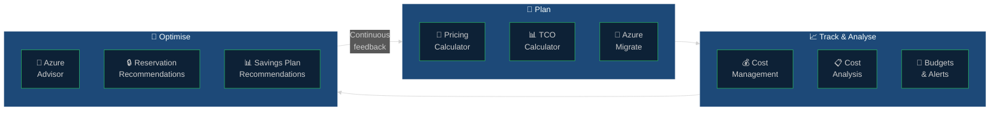
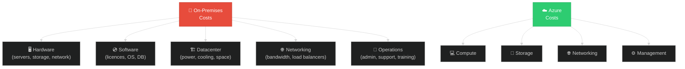
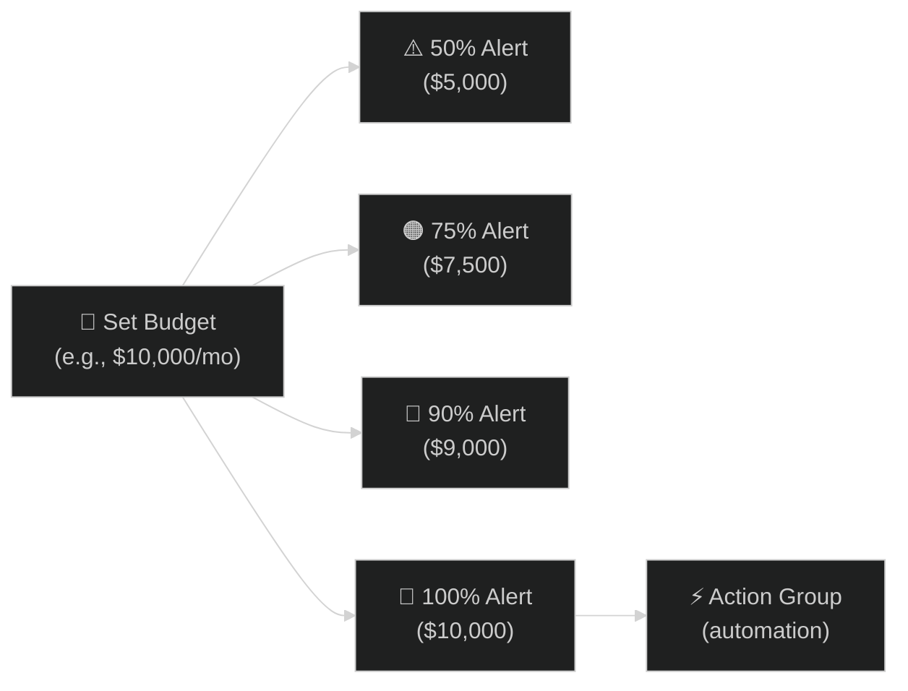

# 🔧 03 — Tools & Calculators
{: .no_toc }

[🏠 Home](/waf-cost-opt/){: .btn .btn-outline .fs-3 }

  
📑 Table of Contents

  {: .text-delta }
- TOC
{:toc}

---

## Overview

Azure provides a rich set of tools for **estimating, tracking, optimising, and governing** cloud costs. These tools support the full cost management lifecycle — from initial planning through ongoing optimisation.

---

## Azure Pricing Calculator

The Azure Pricing Calculator lets you **estimate the cost of Azure services** before deployment. It is the primary tool for pre-deployment cost modelling and supports all Azure services.

| Aspect | Detail |
|--------|--------|
| **URL** | [azure.microsoft.com/pricing/calculator](https://azure.microsoft.com/pricing/calculator) |
| **Cost** | Free |
| **Scope** | Per-solution estimate — mix and match any Azure services |
| **Output** | Monthly cost estimate, exportable to Excel |
| **Currency** | Supports multiple currencies |

### Key Features

- **Service configuration** — select SKUs, tiers, instance counts, regions, and storage amounts
- **Saved estimates** — save and share estimates with team members (requires sign-in)
- **Export** — download estimates as Excel for integration into proposals and business cases
- **Scenario comparison** — create multiple estimates to compare architectural options

### CSA Tips for the Pricing Calculator

- **Build estimates together with the customer** — it serves as a design conversation tool, not just a pricing lookup
- **Include all components** — don't forget networking (egress, VPN gateways), storage transactions, logging, and monitoring
- **Model different tiers** — show the customer the cost difference between Basic, Standard, and Premium SKUs
- **Compare regions** — demonstrate regional pricing differences for pre-production environments
- **Factor in data transfer** — egress charges are often overlooked and can be significant

---

## TCO Calculator

The **Total Cost of Ownership (TCO) Calculator** helps organisations compare the cost of running workloads **on-premises vs. in Azure**. It is primarily used for migration business cases.

| Aspect | Detail |
|--------|--------|
| **URL** | [azure.microsoft.com/pricing/tco/calculator](https://azure.microsoft.com/pricing/tco/calculator/) |
| **Cost** | Free |
| **Scope** | On-premises vs. Azure comparison |
| **Output** | 1–5 year cost comparison report |

### What the TCO Calculator Covers

### CSA Tips for the TCO Calculator

- **Use it for executive conversations** — the TCO report is designed for business decision-makers, not engineers
- **Be conservative with assumptions** — overly optimistic TCO projections erode trust when actuals differ
- **Include Azure Hybrid Benefit** — it significantly improves the Azure-side numbers for customers with existing licences
- **Adjust labour costs** — default values may not reflect the customer's actual operational costs

---

## Microsoft Cost Management

**Microsoft Cost Management** (formerly Azure Cost Management + Billing) is the primary in-portal tool for tracking, analysing, and optimising Azure spending.

| Aspect | Detail |
|--------|--------|
| **Location** | Azure portal → Cost Management |
| **Cost** | Free for all Azure customers |
| **Scope** | Subscription, resource group, management group, or billing account |
| **Key features** | Cost analysis, budgets, alerts, exports, recommendations |

### Cost Analysis

Cost Analysis is the core reporting interface within Cost Management. It provides customisable views of spending data.

| Feature | Description |
|---------|-------------|
| **Accumulated view** | Running total of costs over a period |
| **Daily view** | Day-by-day spending breakdown |
| **Group by** | Resource, resource group, service, tag, region, meter |
| **Filter** | Narrow by subscription, resource group, tag, service, location |
| **Forecast** | AI-generated spending forecast based on historical patterns |
| **Export** | Download CSV or connect to Power BI |

### Key Questions Cost Analysis Answers

| Question | How to Answer |
|----------|---------------|
| How much have I spent this month so far? | Accumulated cost view, current billing period |
| What is my most expensive service? | Group by Service name, sort descending |
| Are there spending anomalies? | Daily view — look for unexpected spikes |
| How does this month compare to last month? | Change date range, compare periods |
| Which team/project is spending the most? | Group by tag (requires consistent tagging) |
| What is my forecast for end of month? | Enable forecast view |

### Budgets and Alerts

Budgets allow you to set **spending limits** and receive **alerts** when thresholds are approached or exceeded.

| Feature | Description |
|---------|-------------|
| **Budget scope** | Subscription, resource group, or management group |
| **Threshold alerts** | Configure alerts at 50%, 75%, 90%, 100%, etc. |
| **Alert recipients** | Email notifications to specified users |
| **Action Groups** | Trigger automated responses (e.g., shut down VMs, send Slack notifications) |
| **Budget types** | Cost-based or usage-based |

### Cost Management Exports

Exports allow you to **automatically push cost data** to Azure Storage for integration with external systems.

| Feature | Description |
|---------|-------------|
| **Frequency** | Daily, weekly, or monthly |
| **Destination** | Azure Blob Storage |
| **Format** | CSV |
| **Integration** | Power BI, Azure Synapse, custom analytics |
| **API** | Exports API for programmatic management |

---

## Azure Advisor

**Azure Advisor** is a personalised cloud consultant that provides **recommendations** across five categories, including cost.

| Aspect | Detail |
|--------|--------|
| **Location** | Azure portal → Advisor |
| **Cost** | Free |
| **Categories** | Cost, Security, Reliability, Operational Excellence, Performance |
| **Update frequency** | Recommendations refresh regularly based on resource telemetry |

### Cost Recommendations

Advisor analyses your resource usage and configuration to identify cost-saving opportunities:

| Recommendation Type | Example |
|--------------------|---------|
| **Right-sizing VMs** | Downsize VMs with low CPU/memory utilisation |
| **Shut down idle resources** | Identify VMs running with near-zero utilisation |
| **Reserved Instance opportunities** | Based on 30-day usage, recommend RI purchases |
| **Savings Plan opportunities** | Suggest compute savings plans based on usage patterns |
| **Unused resources** | Identify unattached disks, idle load balancers, unused public IPs |
| **Storage optimisation** | Recommend storage tier changes (Hot → Cool → Archive) |

### CSA Tips for Azure Advisor

- **Start every cost review with Advisor** — it provides an immediate, personalised savings baseline
- **Sort recommendations by estimated savings** — focus on the highest-impact items first
- **Track recommendation implementation** — Advisor scores improve as recommendations are addressed
- **Combine with Cost Analysis** — Advisor tells you what to change; Cost Analysis tells you how much you're spending

---

## Azure Migrate

**Azure Migrate** provides discovery, assessment, and migration planning tools. For cost optimisation, its assessment capabilities are particularly valuable.

| Feature | Cost Relevance |
|---------|---------------|
| **Discovery** | Inventory on-premises servers, databases, and web apps |
| **Assessment** | Azure readiness, right-sized VM recommendations, cost estimates |
| **TCO analysis** | Compare on-premises costs vs. Azure costs |
| **Dependency mapping** | Understand workload dependencies for accurate sizing |

---

## Reporting and Visualisation

### Power BI Integration

Microsoft provides a **Cost Management connector for Power BI** that enables advanced cost reporting and dashboards.

| Feature | Description |
|---------|-------------|
| **Connector** | Native Power BI connector for Cost Management data |
| **Scope** | EA billing account or MCA billing profile |
| **Refresh** | Scheduled or on-demand |
| **Use cases** | Executive dashboards, chargeback reports, trend analysis |

### Azure Monitor Workbooks

For operational cost views, **Azure Monitor Workbooks** can combine cost data with performance metrics:

| Use Case | Description |
|----------|-------------|
| **Cost vs. Performance** | Overlay spending trends with CPU/memory utilisation |
| **Resource efficiency** | Identify over-provisioned resources by comparing cost to actual usage |
| **Tag compliance** | Visualise tagging coverage alongside spending |

---

## Tool Selection Guide

| Scenario | Recommended Tool |
|----------|-----------------|
| Estimating cost of a new deployment | **Azure Pricing Calculator** |
| Building a migration business case | **TCO Calculator** + **Azure Migrate** |
| Tracking current Azure spending | **Microsoft Cost Management** (Cost Analysis) |
| Setting spending limits and alerts | **Cost Management Budgets** |
| Finding immediate savings opportunities | **Azure Advisor** |
| Building executive cost dashboards | **Power BI** + Cost Management connector |
| Exporting cost data for external systems | **Cost Management Exports** |
| Automating cost data retrieval | **Cost Management APIs** (Cost Details, Query, Exports) |

---

## Key APIs for Cost Automation

| API | Purpose |
|-----|---------|
| **Cost Details API** | Generate and download detailed, unaggregated cost data (EA/MCA) |
| **Query API** | Custom, on-demand cost queries |
| **Exports API** | Automate scheduled cost data exports to storage |
| **Budgets API** | Programmatically create and manage budgets |
| **Price Sheet API** | Retrieve negotiated and retail meter rates |
| **Benefit Recommendations API** | Get RI/Savings Plan recommendations based on usage |
| **Dimensions API** | List available dimensions for cost analysis |

> **Full API reference:** [Cost Management API documentation](https://learn.microsoft.com/en-us/rest/api/cost-management/)

---

[← Previous: Savings Opportunities](/waf-cost-opt/02-savings-opportunities/){: .btn .btn-outline .fs-5 .mr-2 }
[Next → 04 — Governance & Automation](/waf-cost-opt/04-governance-automation/){: .btn .btn-primary .fs-5 }

[🏠 Home](/waf-cost-opt/){: .btn .btn-outline .fs-3 }
