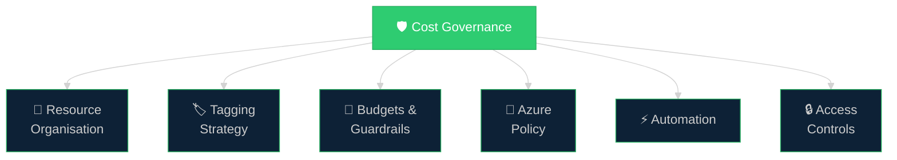
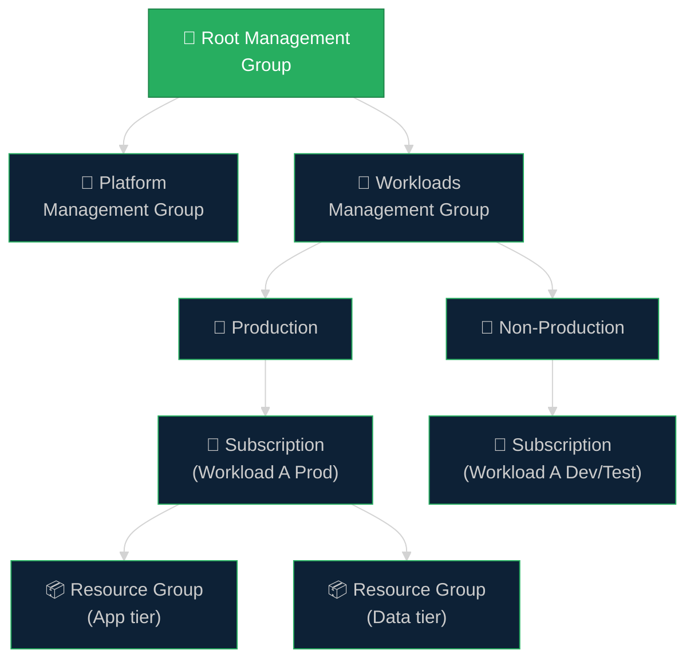
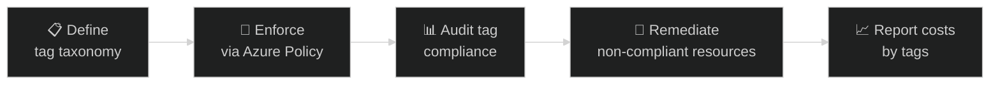
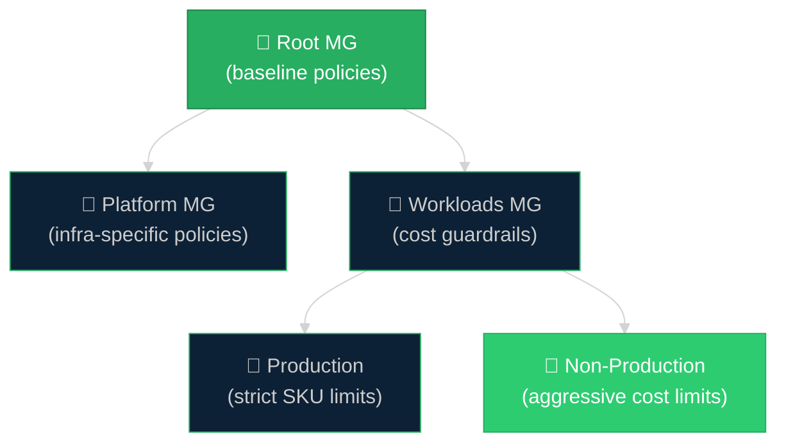

# 🛡️ 04 — Governance & Automation
{: .no_toc }

[🏠 Home](/waf-cost-opt/){: .btn .btn-outline .fs-3 }

  
📑 Table of Contents

  {: .text-delta }
- TOC
{:toc}

---

## Overview

Cost governance ensures that cost discipline is **enforceable, repeatable, and sustainable** — not dependent on individual awareness. This section maps to checklist items **CO:01** (culture of financial responsibility) and **CO:04** (spending guardrails).

Without governance:
- Budgets exist on paper but are exceeded without consequence
- Resources are deployed without cost awareness
- Tagging is inconsistent, making cost attribution impossible
- Orphaned resources accumulate silently

---

## Resource Organisation

A well-structured Azure hierarchy is the foundation of cost governance. The hierarchy determines how costs are attributed, reported, and controlled.

### Organisation Principles for Cost

| Principle | Implementation |
|-----------|---------------|
| **Separate prod from non-prod** | Use different subscriptions (enables Dev/Test pricing and different governance rules) |
| **Align subscriptions to workloads** | Makes cost attribution natural — each subscription maps to a cost centre |
| **Use management groups for policy inheritance** | Apply cost policies (e.g., allowed regions, allowed SKUs) at the management group level |
| **Use resource groups for lifecycle management** | Group resources that share the same lifecycle — easier to identify and clean up |

---

## Tagging Strategy

Tags are the primary mechanism for **cost attribution, reporting, and chargeback/showback** in Azure. Without consistent tagging, cost analysis is limited to resource-level views.

### Recommended Cost Tags

| Tag Name | Purpose | Example Value |
|----------|---------|---------------|
| `CostCenter` | Map to organisational cost centre | `CC-12345` |
| `Owner` | Identify who is responsible | `team-platform@contoso.com` |
| `Environment` | Classify environment type | `Production`, `Development`, `Staging` |
| `Project` | Associate with project or initiative | `Project-Phoenix` |
| `Application` | Identify the application or workload | `ERP-Backend` |
| `BusinessUnit` | Map to business division | `Engineering`, `Marketing` |
| `Criticality` | Indicate business criticality | `High`, `Medium`, `Low` |
| `DataClassification` | Data sensitivity (also useful for security) | `Confidential`, `Internal`, `Public` |

### Tagging Enforcement

| Enforcement Level | Azure Policy Effect | Description |
|-------------------|:-------------------:|-------------|
| **Audit** | `audit` | Flag non-compliant resources but don't block deployment |
| **Deny** | `deny` | Block deployment of resources missing required tags |
| **Modify** | `modify` | Automatically add or correct tags on deployment |
| **Inherit** | `modify` | Inherit tag values from the resource group or subscription |

### Tag Inheritance

Azure Policy can automatically inherit tags from parent scopes:

| Source | Target | Policy Type |
|--------|--------|-------------|
| Resource Group → Resources | Tags on RG flow down to child resources | Built-in: "Inherit a tag from the resource group" |
| Subscription → Resource Groups | Tags on subscription flow to RGs | Built-in: "Inherit a tag from the subscription" |

> **CSA Tip:** Start with `CostCenter`, `Owner`, and `Environment` as mandatory tags — these cover 80% of cost attribution needs.

---

## Azure Policy for Cost Control

Azure Policy provides **declarative guardrails** that prevent cost-increasing actions before they happen.

### Cost-Relevant Built-In Policies

| Policy | Effect | Cost Impact |
|--------|:------:|-------------|
| **Allowed locations** | Deny | Prevent deployment to expensive or unapproved regions |
| **Allowed virtual machine size SKUs** | Deny | Prevent deployment of oversized or premium VMs |
| **Require tag on resources** | Deny/Audit | Ensure cost attribution tags are always present |
| **Inherit tag from resource group** | Modify | Automate tag propagation for cost reporting |
| **Not allowed resource types** | Deny | Block expensive or unapproved resource types |
| **Allowed storage account SKUs** | Deny | Prevent premium storage where standard suffices |

### Custom Policy Examples

| Scenario | Policy Logic |
|----------|-------------|
| **Limit VM sizes in dev/test** | Deny any VM SKU larger than D4s_v5 in non-production subscriptions |
| **Require reservation tag** | Audit resources that could benefit from reservations but lack a tracking tag |
| **Block premium services** | Deny Premium-tier deployments in cost-sensitive subscriptions |
| **Enforce shutdown schedule** | Require the `AutoShutdown` tag on all VMs |

### Policy Assignment Strategy

---

## Budgets and Spending Guardrails

Budgets are set at **subscription or resource group scope** and trigger notifications (and optionally automated actions) when spending approaches defined thresholds.

### Budget Configuration

| Parameter | Guidance |
|-----------|---------|
| **Scope** | Start at subscription level, then add resource group budgets for high-spend workloads |
| **Amount** | Based on cost model (CO:02) — include buffer for unplanned spending (10–20%) |
| **Reset period** | Monthly (aligns with billing cycles) |
| **Thresholds** | Set alerts at 50%, 75%, 90%, and 100% of budget |
| **Alert recipients** | Subscription owners, workload owners, FinOps team |

### Automated Budget Actions

When budget thresholds are reached, **Action Groups** can trigger automated responses:

| Action | Use Case |
|--------|----------|
| **Send email** | Notify team leads and finance |
| **Run Azure Function** | Execute custom logic (e.g., tag non-essential resources for review) |
| **Trigger Logic App** | Post to Slack/Teams, create a service ticket |
| **Scale down resources** | Reduce VM sizes or scale sets in non-production |
| **Shut down VMs** | Stop non-essential VMs in dev/test environments |

> **Caution:** Automated shutdowns should only apply to non-production environments. Never auto-stop production workloads based on budget alerts alone.

---

## Access Controls (RBAC) for Cost

RBAC can be used to control who can **deploy resources, view costs, and modify budgets**.

### Cost-Related RBAC Roles

| Role | Permissions |
|------|------------|
| **Cost Management Reader** | View cost data, budgets, and recommendations — no write access |
| **Cost Management Contributor** | Create and manage budgets, exports, and views |
| **Billing Reader** | View billing information and invoices |
| **Subscription Owner** | Full control including cost management |

### Principle of Least Privilege for Cost

- **Developers** should see the cost of their resource groups (Cost Management Reader on RG)
- **Team leads** should see subscription-level costs and manage budgets (Cost Management Contributor on subscription)
- **FinOps team** should see cross-subscription costs (Cost Management Reader on management group)
- **Finance** should see billing data (Billing Reader on billing account)

---

## Cost Automation Patterns

Automation reduces the **operational overhead** of cost management and ensures consistency.

### Auto-Shutdown for Dev/Test VMs

| Feature | Detail |
|---------|--------|
| **Built-in** | Azure VM auto-shutdown (Settings → Auto-shutdown) |
| **Schedule** | Set shutdown time and timezone — VMs stop automatically |
| **Notifications** | Optional email 30 minutes before shutdown |
| **Limitation** | Does not auto-start — use Azure Automation or Start/Stop VMs solution for that |

### Start/Stop VMs v2

The **Start/Stop VMs v2** solution uses Azure Functions and Logic Apps to manage VM schedules.

| Feature | Detail |
|---------|--------|
| **Start and stop** | Schedule both start and stop times |
| **Scope** | Tag-based, resource group, or subscription |
| **Sequencing** | Start/stop VMs in order (useful for multi-tier apps) |
| **Cost savings** | Significant for VMs that don't need to run 24/7 |

### Azure Automation Runbooks

For custom cost automation, **Azure Automation runbooks** (PowerShell or Python) can:

- Right-size VMs based on Azure Advisor recommendations
- Delete unattached managed disks
- Remove unused public IP addresses
- Scale down resources on weekends
- Generate and email cost reports

### Infrastructure as Code (IaC)

IaC practices inherently support cost governance:

| Practice | Cost Benefit |
|----------|-------------|
| **Template-based deployment** | Ensures consistent, approved resource configurations |
| **Parameter constraints** | Limit SKU choices and instance counts in templates |
| **Drift detection** | Identify manual changes that may increase costs |
| **Environment parity** | Deploy non-production environments from the same templates with lower SKU parameters |
| **Destroy and recreate** | Ephemeral environments cost nothing when they don't exist |

---

## Governance Maturity Checklist

Use this checklist to assess and improve cost governance maturity:

| Practice | Level 1 (Basic) | Level 2 (Standard) | Level 3 (Advanced) |
|----------|:---------------:|:------------------:|:------------------:|
| **Tagging** | Optional, inconsistent | Mandatory tags enforced via Policy (audit) | Tag inheritance, automated remediation, deny on missing |
| **Budgets** | Annual budget exists on paper | Monthly budgets with email alerts at 75%, 100% | Automated actions at thresholds, per-workload budgets |
| **RBAC** | Everyone is Owner or Contributor | Cost Management Reader for developers | Least-privilege with custom roles per team |
| **Policy** | No policies | Allowed regions and VM sizes | Comprehensive initiatives covering tags, SKUs, regions |
| **Automation** | Manual shutdown of unused resources | Auto-shutdown on dev/test VMs | IaC, scheduled scaling, automated right-sizing |
| **Reporting** | Ad-hoc portal checks | Monthly cost reviews | Automated dashboards, chargeback/showback |

---

## CSA Tips for Governance Conversations

- **Start with tagging** — it's the lowest-friction, highest-impact governance practice
- **Don't enforce `deny` policies on day one** — start with `audit`, build compliance, then switch to `deny`
- **Separate prod and non-prod early** — it unlocks Dev/Test pricing and enables aggressive cost policies for non-production
- **Automate what you can** — manual cost management doesn't scale
- **Make cost visible** — teams that can see their spending make better decisions

---

[← Previous: Tools & Calculators](/waf-cost-opt/03-tools/){: .btn .btn-outline .fs-5 .mr-2 }
[Next → 05 — FinOps Appendix](/waf-cost-opt/05-appendix-finops/){: .btn .btn-primary .fs-5 }

[🏠 Home](/waf-cost-opt/){: .btn .btn-outline .fs-3 }
