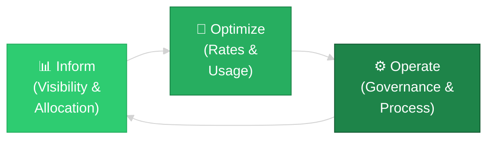
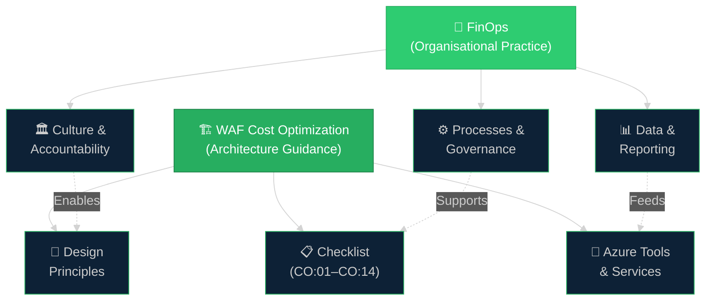

# 📘 05 — FinOps Appendix
{: .no_toc }

[🏠 Home](/waf-cost-opt/){: .btn .btn-outline .fs-3 }

  
📑 Table of Contents

  {: .text-delta }
- TOC
{:toc}

---

## What Is FinOps?

**FinOps** (Financial Operations) is a cultural practice and operational framework that brings financial accountability to cloud spending. It enables organisations to make informed, data-driven decisions about cloud investment by bringing together technology, finance, and business teams.

FinOps is **not a cost-cutting exercise** — it is about maximising the business value derived from every unit of cloud spend.

> **FinOps Foundation:** [finops.org](https://www.finops.org/) (part of The Linux Foundation)

---

## FinOps Principles

The FinOps Foundation defines six core principles:

| Principle | Description |
|-----------|-------------|
| **Teams need to collaborate** | Finance, engineering, product, and management work together on cloud cost decisions |
| **Everyone takes ownership** | Individual engineers and teams are accountable for their cloud usage |
| **A centralised team drives FinOps** | A FinOps team (or Cloud Centre of Excellence) establishes best practices and enables adoption |
| **Reports should be accessible and timely** | Cost data must be available quickly and at the right level of detail for each stakeholder |
| **Decisions are driven by business value** | Cloud spending decisions are based on business value, not just cost reduction |
| **Take advantage of the variable cost model** | Cloud's pay-as-you-go nature is a feature, not a bug — use it strategically |

---

## The FinOps Lifecycle

FinOps operates as a continuous cycle of three phases:

### Inform

| Activity | Description |
|----------|-------------|
| **Cost visibility** | Make cloud spending transparent to all stakeholders |
| **Cost allocation** | Attribute costs to teams, projects, and workloads via tagging and hierarchy |
| **Showback / Chargeback** | Share cost information (showback) or charge back to business units (chargeback) |
| **Benchmarking** | Compare unit costs across teams and over time |
| **Anomaly detection** | Identify unexpected spending patterns early |

### Optimize

| Activity | Description |
|----------|-------------|
| **Right-sizing** | Match resource capacity to actual demand |
| **Rate optimization** | Use Reservations, Savings Plans, AHB, Spot VMs |
| **Waste elimination** | Remove orphaned resources, unattached disks, idle load balancers |
| **Architecture optimization** | Redesign for cost efficiency (serverless, containers, managed services) |
| **Licence optimization** | Consolidate and right-size software licences |

### Operate

| Activity | Description |
|----------|-------------|
| **Budgets and forecasts** | Set, track, and refine financial targets |
| **Policy enforcement** | Use Azure Policy, RBAC, and automation to enforce guardrails |
| **Continuous improvement** | Regular cost reviews, retrospectives, and process refinement |
| **Training and enablement** | Upskill teams on cost-aware cloud engineering |
| **KPI tracking** | Monitor FinOps maturity metrics (unit economics, coverage ratios) |

---

## FinOps and WAF Cost Optimization

FinOps and the WAF Cost Optimization pillar are **complementary frameworks** — FinOps provides the organisational and cultural model, while WAF provides the technical architecture guidance.

| FinOps Phase | WAF Checklist Items |
|:------------:|:-------------------:|
| **Inform** | CO:02 (Cost model), CO:03 (Collect cost data) |
| **Optimize** | CO:05 (Best rates), CO:07 (Component costs), CO:08–CO:12 (Environment/flow/data/code/scaling) |
| **Operate** | CO:01 (Financial responsibility), CO:04 (Guardrails), CO:13 (Personnel time), CO:14 (Consolidation) |

---

## FinOps Maturity Model

The FinOps Foundation defines a maturity model with three levels:

| Level | Name | Description |
|:-----:|------|-------------|
| **Crawl** | Foundational | Basic cost visibility, manual reporting, initial tagging, reactive cost management |
| **Walk** | Intermediate | Automated reporting, consistent tagging, commitment-based pricing in use, regular reviews |
| **Run** | Advanced | Real-time cost data, automated optimisation, FinOps embedded in SDLC, unit economics tracked |

### Crawl → Walk → Run Examples

| Capability | Crawl | Walk | Run |
|-----------|-------|------|-----|
| **Tagging** | Optional, inconsistent | Enforced via policy (audit) | Automated inheritance, deny on missing |
| **Reporting** | Ad-hoc portal checks | Monthly reports, Power BI dashboards | Real-time dashboards, automated anomaly alerts |
| **Reservations** | None | Some RI purchases for largest VMs | Systematic RI + Savings Plan coverage, tracked utilisation |
| **Right-sizing** | None | Quarterly Advisor reviews | Automated right-sizing recommendations actioned monthly |
| **Budgets** | Annual budget only | Monthly budgets with alerts | Per-workload budgets with automated actions |
| **Accountability** | IT pays the bill | Cost visible to team leads | Engineers see real-time cost impact of their deployments |

---

## Glossary of Terms

### Azure Billing & Licensing

| Term | Definition |
|------|-----------|
| **Amortised cost** | The cost of a prepaid commitment (e.g., Reservation) spread evenly over the term |
| **Azure Hybrid Benefit (AHB)** | A licensing benefit that lets you use on-premises Windows Server or SQL Server licences on Azure |
| **Azure Prepayment** | Formerly "Monetary Commitment" — an upfront payment towards Azure consumption under an EA |
| **Billing account** | The top-level billing entity in Azure (EA enrolment or MCA billing account) |
| **Billing profile** | An entity within an MCA billing account that groups subscriptions for invoicing |
| **Chargeback** | Allocating actual cloud costs back to the business units that consumed them |
| **Commitment-based pricing** | A billing model where you commit to a fixed amount of usage (1y or 3y) for a discount |
| **Consumption-based pricing** | Pay-as-you-go pricing — you pay for what you use with no upfront commitment |
| **Cost centre** | An organisational unit to which costs are attributed for financial tracking |
| **Dev/Test pricing** | Discounted Azure pricing for non-production workloads, available to Visual Studio subscribers |
| **Enterprise Agreement (EA)** | A multi-year licensing agreement between an organisation and Microsoft |
| **Incurred cost** | The actual metered cost for the current period (before amortisation of commitments) |
| **Licence Mobility** | The right to move eligible licences from on-premises to Azure under Software Assurance |
| **Meter** | The unit of measurement for billing an Azure service (e.g., per hour, per GB, per transaction) |
| **Microsoft Customer Agreement (MCA)** | A streamlined purchasing agreement that replaces EA for many customers |
| **Pay-as-you-go (PAYG)** | Consumption-based billing with no commitment — charged at retail rates |
| **Price sheet** | A customer-specific list of negotiated meter rates (available via API for EA/MCA) |
| **Reservation** | A 1- or 3-year prepaid commitment for specific Azure resources at a discounted rate |
| **Savings Plan** | A 1- or 3-year commitment to a fixed hourly compute spend at a discounted rate |
| **Showback** | Making cost data visible to business units for awareness, without financial charge-back |
| **Software Assurance (SA)** | A Microsoft licensing programme that provides upgrade rights, training, and migration benefits |
| **Spot VM** | An Azure VM using unused capacity at a deep discount, subject to eviction |
| **Subscription** | A billing and management container for Azure resources |

### Cost Management Concepts

| Term | Definition |
|------|-----------|
| **Anomaly detection** | Automated identification of unusual spending patterns in cost data |
| **Budget** | A spending limit set at a scope (subscription, RG, MG) with alert thresholds |
| **Cost allocation** | The process of attributing cloud costs to teams, projects, or workloads |
| **Cost model** | A framework for estimating and forecasting the total cost of a workload |
| **Forecast** | A projected estimate of future spending based on historical trends |
| **Idle resource** | A deployed resource with little or no utilisation that is still incurring charges |
| **Orphaned resource** | A resource that is no longer associated with an active workload (e.g., unattached disk) |
| **Right-sizing** | Adjusting resource capacity (SKU, tier, instance count) to match actual demand |
| **Spending guardrail** | A policy, budget, or access control that prevents or alerts on overspending |
| **TCO (Total Cost of Ownership)** | The full cost of running a workload — including infrastructure, licences, operations, and personnel |
| **Unit economics** | The cost per business-meaningful unit (e.g., cost per transaction, cost per user, cost per order) |
| **Waste** | Cloud spend that does not contribute to business value (idle resources, over-provisioning, orphaned assets) |

### Architecture & Design

| Term | Definition |
|------|-----------|
| **Active-active** | A deployment model where all instances handle traffic simultaneously |
| **Active-passive** | A deployment model where standby instances only activate during failover |
| **Auto-scaling** | Automatic adjustment of resource capacity based on demand signals |
| **Density** | The number of workloads or tenants served per unit of infrastructure |
| **Scale unit** | A defined boundary of resources that scales as a unit (e.g., a set of VMs + DB + storage) |
| **SKU (Stock Keeping Unit)** | A specific configuration or tier of an Azure service (e.g., Standard_D4s_v5) |
| **Tier** | A pricing level within a service (e.g., Basic, Standard, Premium) |

### FinOps-Specific

| Term | Definition |
|------|-----------|
| **Cloud Centre of Excellence (CCoE)** | A cross-functional team responsible for cloud governance, standards, and best practices |
| **FinOps** | A cultural practice and framework for managing cloud financial operations |
| **FinOps Foundation** | The industry body (under The Linux Foundation) that defines FinOps standards and certifications |
| **FinOps Certified Practitioner** | A professional certification for FinOps practitioners |
| **Inform phase** | The FinOps phase focused on visibility, allocation, and benchmarking |
| **Optimize phase** | The FinOps phase focused on rate and usage optimisation |
| **Operate phase** | The FinOps phase focused on governance, process, and continuous improvement |
| **Unit cost** | The cost normalised to a business metric (e.g., cost per API call) |

---

## Key Acronyms

| Acronym | Full Form |
|---------|-----------|
| **AHB** | Azure Hybrid Benefit |
| **BYOL** | Bring Your Own Licence |
| **CCoE** | Cloud Centre of Excellence |
| **CSP** | Cloud Solution Provider |
| **EA** | Enterprise Agreement |
| **IaC** | Infrastructure as Code |
| **MCA** | Microsoft Customer Agreement |
| **MPSA** | Microsoft Products and Services Agreement |
| **PAYG** | Pay-As-You-Go |
| **RBAC** | Role-Based Access Control |
| **RI** | Reserved Instance |
| **ROI** | Return on Investment |
| **SA** | Software Assurance |
| **SKU** | Stock Keeping Unit |
| **SLA** | Service Level Agreement |
| **SLO** | Service Level Objective |
| **SP** | Savings Plan |
| **TCO** | Total Cost of Ownership |
| **WAF** | Well-Architected Framework |

---

## Further Reading

| Resource | Link |
|----------|------|
| FinOps Foundation | [finops.org](https://www.finops.org/) |
| FinOps with Azure | [Microsoft Learn — FinOps](https://learn.microsoft.com/en-us/azure/cost-management-billing/finops/) |
| WAF Cost Optimization | [Cost Optimization pillar](https://learn.microsoft.com/en-us/azure/well-architected/cost-optimization/) |
| WAF Cost Optimization Training | [Microsoft Learn module](https://learn.microsoft.com/en-us/training/modules/azure-well-architected-cost-optimization/) |
| Azure Architecture Centre | [Browse architectures](https://learn.microsoft.com/en-us/azure/architecture/browse/) |

---

[← Previous: Governance & Automation](/waf-cost-opt/04-governance-automation/){: .btn .btn-outline .fs-5 .mr-2 }

[🏠 Home](/waf-cost-opt/){: .btn .btn-outline .fs-3 }
