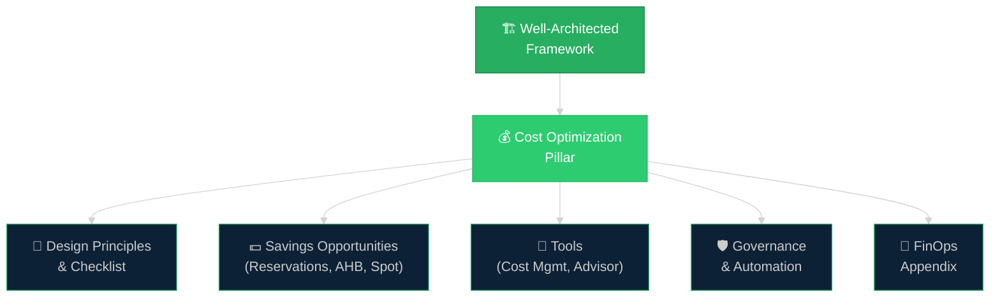
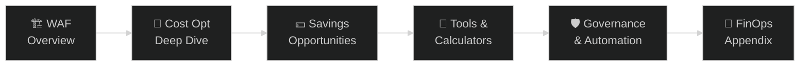

# 💰 Azure WAF: Cost Optimization — Deep Dive
{: .no_toc }

**Companion notes covering architectures' best practices and Cost Optimization strategies**
{: .fs-5 .fw-300 }

[Get Started →](/waf-cost-opt/00-waf-overview){: .btn .btn-primary .fs-5 .mb-4 .mb-md-0 .mr-2 }
[View on GitHub](https://github.com/marcogrimaldi29/waf-cost-opt){: .btn .fs-5 .mb-4 .mb-md-0 target="_blank" }

---

> 🏠 Maintained by **[Marco Grimaldi](https://www.linkedin.com/in/marco-grimaldi29/)** — Cloud Solution Architect.
> Based on the **[official Microsoft WAF Cost Optimization documentation](https://learn.microsoft.com/en-us/azure/well-architected/cost-optimization/)**.
> Find more notes and content at **[🌐 marcogrimaldi29.com](https://marcogrimaldi29.com)**.
> *Not affiliated with or endorsed by Microsoft. Always verify against the latest documentation.*

---

## 📌 What Is This?

These notes serve as a **companion reference** to the official Azure Well-Architected Framework documentation, focusing on the **Cost Optimization pillar**. They are designed for **Cloud Solution Architects** involved in customer conversations around WAF reviews, cost governance, and financial optimization on Azure.

The content covers the full scope of Cost Optimization — from design principles and the official checklist, through practical savings mechanisms (Reservations, Savings Plans, Azure Hybrid Benefit), to the tools and governance practices that make cost discipline sustainable.

---

## 🗺️ WAF Cost Optimization at a Glance

---

## 🗂️ Notes Index

<h3 style="margin-top:0;">🏗️ 00 — WAF Overview</h3>

The Well-Architected Framework, its five pillars, how Cost Optimization fits, and the WAF review process.

<a href="/waf-cost-opt/00-waf-overview/" class="btn btn-outline fs-5">Read →</a>

<h3 style="margin-top:0;">📐 01 — Cost Optimization Deep Dive</h3>

Design principles, the CO:01–CO:14 checklist, tradeoffs with other pillars, and the maturity model.

<a href="/waf-cost-opt/01-cost-optimization-deep-dive/" class="btn btn-outline fs-5">Read →</a>

<h3 style="margin-top:0;">💵 02 — Savings Opportunities</h3>

Azure Reservations, Savings Plans, Azure Hybrid Benefit, Spot VMs, Dev/Test pricing, and licensing strategies.

<a href="/waf-cost-opt/02-savings-opportunities/" class="btn btn-outline fs-5">Read →</a>

<h3 style="margin-top:0;">🔧 03 — Tools & Calculators</h3>

Azure Pricing Calculator, TCO Calculator, Microsoft Cost Management, Azure Advisor, and reporting.

<a href="/waf-cost-opt/03-tools/" class="btn btn-outline fs-5">Read →</a>

<h3 style="margin-top:0;">🛡️ 04 — Governance & Automation</h3>

Budgets, spending guardrails, tagging strategies, Azure Policy, and cost automation.

<a href="/waf-cost-opt/04-governance-automation/" class="btn btn-outline fs-5">Read →</a>

<h3 style="margin-top:0;">📘 05 — FinOps Appendix</h3>

FinOps framework overview, glossary of financial and cloud cost terms, and key acronyms for CSA conversations.

<a href="/waf-cost-opt/05-appendix-finops/" class="btn btn-outline fs-5">Read →</a>

---

## 🧭 Navigation Flow

---

## 📄 Official Resources

| Resource | Link |
|----------|------|
| 🏗️ Azure Well-Architected Framework | [Well-Architected Framework](https://learn.microsoft.com/en-us/azure/well-architected/) |
| 💰 Cost Optimization Pillar | [Cost Optimization](https://learn.microsoft.com/en-us/azure/well-architected/cost-optimization/) |
| 📋 WAF Assessment Tool | [Well-Architected Review](https://learn.microsoft.com/en-us/assessments/azure-architecture-review/) |
| 🔧 Microsoft Cost Management | [Cost Management best practices](https://learn.microsoft.com/en-us/azure/cost-management-billing/costs/cost-mgt-best-practices) |
| 🧮 Azure Pricing Calculator | [Azure Pricing Calculator](https://azure.microsoft.com/pricing/calculator) |
| 🧭 Azure Advisor | [Azure Advisor](https://learn.microsoft.com/en-us/azure/advisor/advisor-overview) |

---

## ⭐ Support This Project

If you found these notes useful for your WAF reviews or Cost Optimization conversations, consider giving the repo a **star on GitHub** — it helps increase visibility and supports the effort behind keeping this content up to date. Thank you! 🙌

[⭐ Star on GitHub](https://github.com/marcogrimaldi29/waf-cost-opt){: .btn .btn-outline .fs-5 }

---

## ✍️ About the Author

Maintained by **[Marco Grimaldi](https://www.linkedin.com/in/marco-grimaldi29/)** — Cloud Solution Architect.

📍 **Find more content at [🌐 marcogrimaldi29.com](https://marcogrimaldi29.com)**

> These notes are designed to support WAF and Cost Optimization customer conversations. Content is updated as the framework and Azure services evolve. Always cross-check with the latest Microsoft documentation.

Additional study notes and deep dives on Microsoft products, services, and platform experiences are available at the following Landing Page:

👉 **[🛬 Landing Page: Study Notes](https://marcogrimaldi29.com/study-notes/)**

---

## 📈 Analytics

This site uses **[Umami](https://umami.is/)** for privacy-friendly analytics.

---

## ©️ Credits & Acknowledgements

The **[Just the Docs](https://github.com/just-the-docs/just-the-docs)** theme is used for a clean, documentation-style layout. Licensed under [MIT](https://opensource.org/license/MIT).

Created with the help of AI. Model used: **[Claude Opus 4.6](https://www.anthropic.com/news/claude-model-card)**. The content has been reviewed and edited by the author for accuracy and clarity, but may contain errors. Always verify against the latest [Microsoft documentation](https://learn.microsoft.com/en-us/).

> *Not affiliated with or endorsed by Microsoft.*
